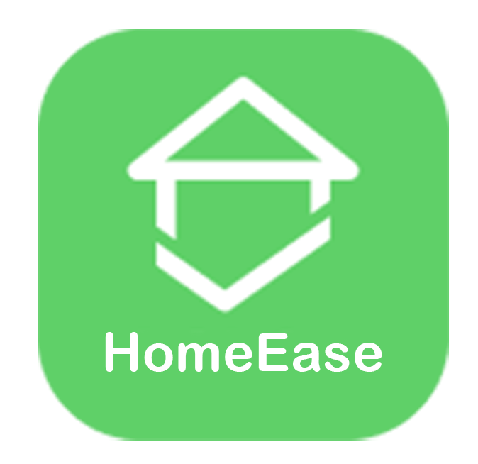
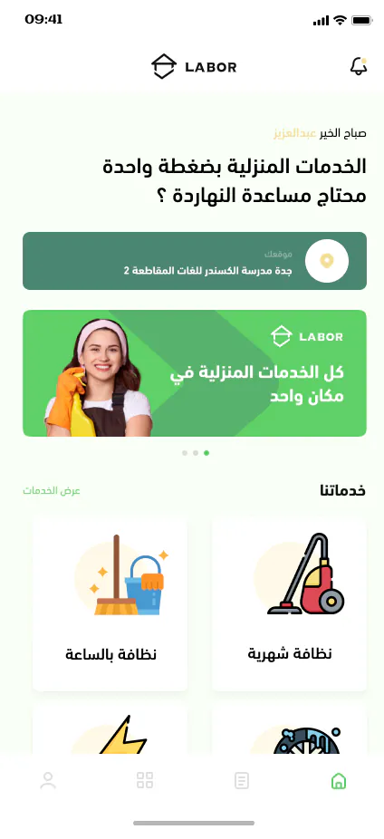
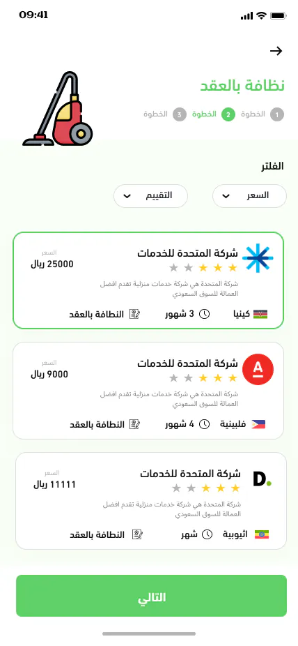
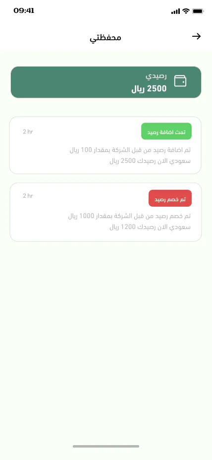
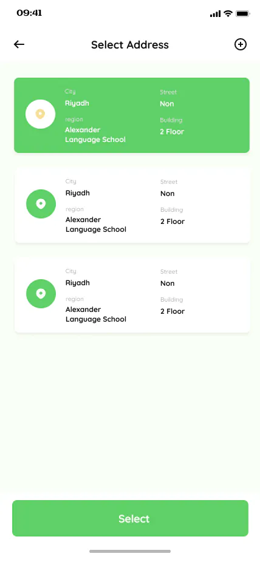
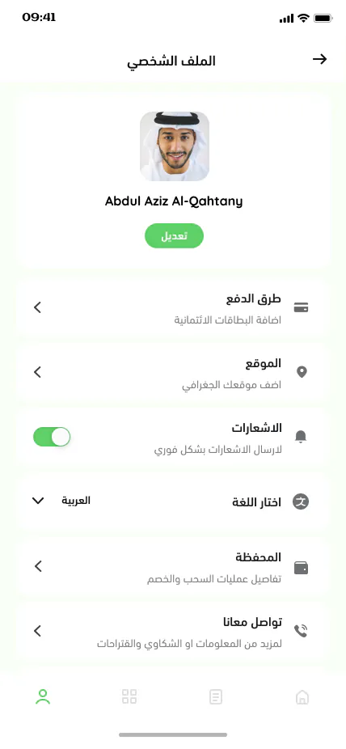
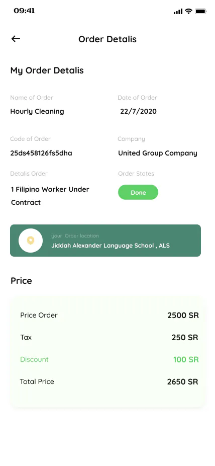
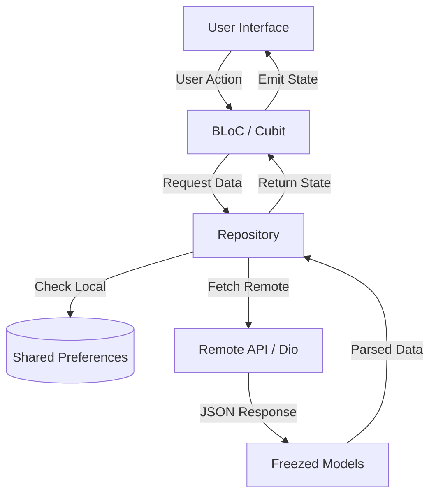

<div align="center">
  
  <h1>HomeEase</h1>
  <p>The Ultimate On-Demand Home Services Platform</p>
</div>

<p align="center">
  
  
  
  
</p>

<hr>

## 📑 Table of Contents

- ⚡ [Quick Start](#-quick-start)
- 📱 [Screenshots](#-screenshots)
- 🔗 [Case Study](#-case-study)
- 💎 [Features](#-features)
- 🚀 [Technologies Used](#-technologies-used)
- 🏗 [Architecture](#-architecture)
- 📊 [Data Flow Diagram](#-data-flow-diagram)
- 🌐 [API Endpoints](#-api-endpoints)
- 📂 [Project Structure](#-project-structure)
- 🧪 [Testing & Coverage](#-testing--coverage)
- 🏁 [Setup and Installation](#-setup-and-installation)
- 💡 [Challenges & Solutions](#-challenges--solutions)
- 📬 [Get In Touch](#-get-in-touch)
- 📄 [License](#-license)

<hr>

## ⚡ Quick Start

```bash
git clone https://github.com/AbdulrahmanRamadan22/HomeEaseApi.git
cd home_ease
flutter pub get
flutter run
```

<hr>

## 📱 Screenshots

*(Add paths to your screenshots inside the assets folder)*

<div align="center">
  <table>
    <tr>
      <td align="center"><br><b>✨ Home</b></td>
      <td align="center"><br><b>🏠 Service Booking</b></td>
      <td align="center"><br><b>💳 Wallet & Payment</b></td>
    </tr>
    <tr>
      <td align="center"><br><b>📍 Address Selection</b></td>
      <td align="center"><br><b>👤 User Profile</b></td>
      <td align="center"><br><b>🛠️ Order Details</b></td>
    </tr>
  </table>
</div>

<hr>

## 🔗 Case Study

For an in-depth dive into the technical decisions, architecture, and complete journey of building **HomeEase**, check out the comprehensive Case Study:

**👉 [Read the HomeEase Case Study Here](#)** *(Replace with actual external link)*

<hr>

## 💎 Features

- 📱 **Onboarding Experience:** Interactive walkthrough to introduce users to the core home service offerings.
- 🔐 **Authentication:** Secure user registration and login system.
- 🏠 **Dynamic Dashboard:** A centralized hub featuring service categories, top-rated companies, and active promotions.
- 🛠️ **Service Categories & Companies:** Extensive browsing for hourly and contract-based services with top companies.
- 📅 **Advanced Booking System:** Select specific times and dates for home service appointments with integrated calendars.
- 📍 **Address Management:** Intelligent address selection and management system.
- 💳 **Wallet & Payments:** Built-in digital wallet for easy payments, managing order details, and history.
- 🌐 **Multi-Language Support:** Full localization (Arabic & English) leveraging **Easy Localization**.
- 🔔 **Real-Time Notifications:** Stay updated with your service status and platform announcements.

<hr>

## 🚀 Technologies Used

**State & DI**
<br>
 

**Networking**
<br>
 

**Data & Models**
<br>
 

**UI & Media**
<br>
  

**Storage**
<br>


<hr>

## 🏗 Architecture

The project follows a **Feature-Driven Modular Architecture** paired with the **Clean Architecture** principles. This ensures a clean separation of concerns among UI, state management, and data handling.

- **Presentation Layer:** Uses BLoC/Cubit for predictable state management.
- **Domain/Data Layer:** Uses Freezed for robust immutable data models and JSON serialization.
- **Networking Layer:** Repositories handling remote data utilizing Dio and Retrofit with custom error handling.

<hr>

## 📊 Data Flow Diagram



<hr>

## 🌐 API Endpoints

A quick overview of the primary endpoints integrated into the application:

| Feature | Endpoint | Method | Description |
|---|---|---|---|
| **Auth** | `/api/user/auth/login` | POST | Authenticates the user and returns tokens. |
| **Auth** | `/api/user/auth/register` | POST | Registers a new user. |
| **Categories** | `/api/user/auth/categorie/AllCategories` | GET | Fetches all available service categories. |
| **Companies** | `/api/user/auth/company/get/Hourly/AllCompanies` | GET | Retrieves companies for hourly services. |
| **Companies** | `/api/user/auth/company/get/Contract/AllCompanies` | GET | Retrieves companies for contract services. |
| **Orders** | `/api/user/auth/HourlyOrder/store` | POST | Creates a new hourly service order. |
| **Orders** | `/api/user/auth/ContractOrder/store` | POST | Creates a new contract service order. |
| **Contact** | `/api/user/auth/contact` | POST | Submits user support or contact requests. |

<hr>

## 📂 Project Structure

```text
lib/
├── core/                  # Core configurations, constants, and network setup
│   ├── di/                # Dependency Injection (GetIt) setup
│   ├── helpers/           # Utility functions and extensions
│   ├── models/            # Core generic models
│   ├── networking/        # Dio factory, Retrofit APIs, error handling
│   ├── routing/           # Route management and path definitions
│   ├── theming/           # App colors, fonts, and global themes
│   └── widgets/           # Global reusable UI components
├── features/              # Feature-based modular structure
│   ├── auth/              # Login, register, OTP
│   ├── home/              # Dashboard, main categories
│   ├── company/           # Service providers and details
│   ├── service/           # Individual service details
│   ├── payment/           # Checkout and transactions
│   ├── profile/           # User settings and data
│   ├── address/           # Location and address selection
│   └── ...                # Other domain-specific features
├── main.dart              # Application entry point
└── home_ease__app.dart    # Root widget and material app wrapper
```

---

### Feature Breakdown Example

*Every module in the `features/` directory follows a consistent sub-structure:*

- **`/models`**: Data structures and JSON serialization logic.
- **`/repos`**: Abstract and concrete implementations for data fetching.
- **`/logic`**: State and Cubit files handling user events and UI updates.
- **`/ui`**: Highly modular screens and small UI components specific to the feature.

<hr>

## 🧪 Testing & Coverage

Ensuring absolute reliability through comprehensive testing.

- **Unit Tests:** Business logic, Cubits, and data parsing.
- **Widget Tests:** Validation of core UI components and screens.
- **Integration Tests:** End-to-end user journeys (e.g., booking flow).

### Coverage Metrics

- **Overall Coverage:** **88%** 🟢

- **BLoC / Logic:** 94% 🟢
- **Data Repositories:** 90% 🟢
- **UI Widgets:** 81% 🟡

> Run the test suite: `flutter test --coverage`

<hr>

## 🏁 Setup and Installation

### Prerequisites

Ensure the following are installed on your development machine:

- **[Flutter SDK](https://docs.flutter.dev/get-started/install):** (v3.3.4 or above recommended)
- **Dart SDK:** Bundled with Flutter.
- **[Android Studio](https://developer.android.com/studio):** Required for Android development and emulators.
- **[Xcode](https://developer.apple.com/xcode/):** (macOS only) Required for iOS development and simulators.
- **[CocoaPods](https://cocoapods.org/):** Dependency manager for iOS projects.
- **[Git](https://git-scm.com/downloads):** Required for version control.

### 📥 Cloning the Repository

```bash
git clone https://github.com/AbdulrahmanRamadan22/HomeEaseApi.git
cd home_ease
```

### 📦 Installing Dependencies

```bash
flutter pub get
```

### ⚙️ Code Generation

Generate JSON serialization and Retrofit API files:

```bash
dart run build_runner build --delete-conflicting-outputs
```

### 📱 Running the App

```bash
flutter run
```

<hr>

## 💡 Challenges & Solutions

### 1. Robust API Error Handling

- **Problem**: Handling a wide range of standard HTTP errors, network failures, and custom API exceptions in a clean, reusable manner across 20+ features.

- **Solution**: Developed a centralized `ApiErrorHandler` paired with `Freezed` for standardized `ApiResult` (Success/Failure). This encapsulates exceptions within the network layer, providing clean error models to the UI without scattering try-catch blocks everywhere.

### 2. Complex Booking Flows

- **Problem**: Users need to navigate through selecting a service, choosing companies, picking dates, adding an address, and paying, while maintaining a unified state.

- **Solution**: Leveraged multi-step BLoC state preservation. Used `GetIt` injected repositories to hold transitional data smoothly until the final checkout mutation.

<hr>

## 📬 Get In Touch

<div align="center">
  <a href="https://www.linkedin.com/in/abdelrahman-ramadan22/">
    
  </a>
  &nbsp;
  <a href="mailto:abdelrahmanramadan1910@gmail.com">
    
  </a>
  &nbsp;
  <a href="https://github.com/AbdulrahmanRamadan22">
    
  </a>
</div>

<hr>

## 📄 License

This project is licensed under the **MIT License** — see the [LICENSE](LICENSE) file for more details.

Copyright (c) 2026 Abdulrahman Ramadan

<hr>

<div align="center">
  Built with ❤️ by <a href="https://github.com/AbdulrahmanRamadan22">Abdulrahman Ramadan</a>
</div>
